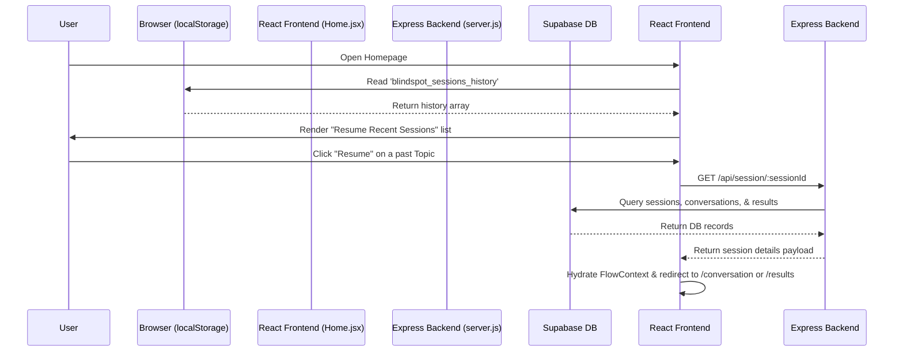

# Implementation Plan: Save & Resume Sessions Across Browser Visits

This plan documents how to implement the **Save & Resume Sessions** feature in BlindSpot. It details the backend API changes, frontend context modifications, Home page UI additions, and verification steps.

---

## 📋 Architectural Overview

To allow users to save and resume learning sessions across browser visits, we will combine **Local History Tracking** (in `localStorage`) with **Database Retrieval** (from Supabase via a new API endpoint).



---

## 📂 Affected Files

1. **[New Backend Route]** `backend/routes/session.js` — Creates the GET endpoint to fetch complete session data.
2. **[Backend Server Entry]** `backend/server.js` — Imports and mounts the session router.
3. **[Frontend Context]** `frontend/src/context/FlowContext.jsx` — Adds session history tracking, state hydration, and backend fetch logic.
4. **[Frontend Homepage]** `frontend/src/pages/Home.jsx` — Renders the recent sessions UI list and triggers loading/resuming.

---

## 🛠️ Phase 1: Backend Implementation

### Step 1: Create `backend/routes/session.js`
Create a new route file to fetch session data from Supabase. It must run async queries across the three tables: `sessions`, `conversations`, and `results`.

Write this exact code to `backend/routes/session.js`:
```javascript
const express = require('express');
const router = express.Router();
const supabase = require('../config/supabase');

// GET /api/session/:sessionId
router.get('/:sessionId', async (req, res) => {
  try {
    const { sessionId } = req.params;

    if (!sessionId || typeof sessionId !== 'string') {
      return res.status(400).json({ error: 'Missing or invalid sessionId parameter' });
    }

    // 1. Query the main sessions table
    const { data: sessionData, error: sessionError } = await supabase
      .from('sessions')
      .select('topic, expert_graph')
      .eq('id', sessionId)
      .single();

    if (sessionError || !sessionData) {
      console.warn(`Session ${sessionId} not found in database:`, sessionError?.message);
      return res.status(404).json({ error: 'Session not found' });
    }

    // 2. Query the conversations table (may be empty if Socratic chat hasn't started)
    const { data: convData, error: convError } = await supabase
      .from('conversations')
      .select('messages, user_model')
      .eq('session_id', sessionId)
      .single();

    // 3. Query the results table (only exists if user finished conversation)
    const { data: resultsData, error: resultsError } = await supabase
      .from('results')
      .select('ranked_gaps, questions')
      .eq('session_id', sessionId)
      .single();

    // 4. Return the assembled payload
    return res.status(200).json({
      sessionId,
      topic: sessionData.topic,
      expertGraph: sessionData.expert_graph,
      chatHistory: convData ? convData.messages : [],
      userModel: convData ? convData.user_model : [],
      rankedGaps: resultsData ? resultsData.ranked_gaps : null,
      questions: resultsData ? resultsData.questions : null
    });

  } catch (error) {
    console.error('Error fetching session data:', error);
    return res.status(500).json({
      error: 'Internal server error while fetching session',
      message: error.message
    });
  }
});

module.exports = router;
```

### Step 2: Mount the route in `backend/server.js`
Mount the newly created router in your Express server configuration.

**Diff Block:**
```diff
 const rateLimit = require('express-rate-limit');
 const agent1Router = require('./routes/agent1');
 const agent2Router = require('./routes/agent2');
 const agent3Router = require('./routes/agent3');
 const agent4Router = require('./routes/agent4');
+const sessionRouter = require('./routes/session');
 
 const app = express();
...
 // Mount routers
 app.use('/api/agent1', agent1Router);
 app.use('/api/agent2', agent2Router);
 app.use('/api/agent3', agent3Router);
 app.use('/api/agent4', agent4Router);
+app.use('/api/session', sessionRouter);
```

---

## 🛠️ Phase 2: Frontend Context Implementation

Modify `frontend/src/context/FlowContext.jsx` to:
1. Handle historical session tracking in `localStorage` under `blindspot_sessions_history`.
2. Provide a `resumeSession` method that calls the backend and loads the retrieved state.

### Update `FlowContext.jsx`
Replace the implementation inside `frontend/src/context/FlowContext.jsx`.

**Add/Update helper methods:**
```javascript
  // Helper to save a session to the local history list
  const saveSessionToHistory = useCallback((id, topic) => {
    if (!id || !topic) return;
    try {
      const historyJson = localStorage.getItem('blindspot_sessions_history');
      let historyList = historyJson ? JSON.parse(historyJson) : [];
      
      // Remove any existing duplicate
      historyList = historyList.filter(item => item.sessionId !== id);
      
      // Prepend newest session to the top
      historyList.unshift({
        sessionId: id,
        topic: topic,
        timestamp: new Date().toISOString()
      });
      
      // Keep only the 5 most recent sessions
      historyList = historyList.slice(0, 5);
      
      localStorage.setItem('blindspot_sessions_history', JSON.stringify(historyList));
    } catch (err) {
      console.warn('Failed to save session to local storage history:', err);
    }
  }, []);
```

Integrate `saveSessionToHistory` inside your `setSessionId` hook:
```javascript
  const setSessionId = useCallback((id) => {
    setSessionIdState(id)
    if (id) {
      localStorage.setItem('blindspot_session_id', id)
      // Save topic to history listing as well if it's already active
      if (activeTopic) {
        saveSessionToHistory(id, activeTopic);
      }
    } else {
      localStorage.removeItem('blindspot_session_id')
    }
  }, [activeTopic, saveSessionToHistory]);

  const setActiveTopic = useCallback((topic) => {
    setActiveTopicState(topic)
    if (topic) {
      localStorage.setItem('blindspot_topic', topic)
      // Save to history listing if sessionId is already active
      if (sessionId) {
        saveSessionToHistory(sessionId, topic);
      }
    } else {
      localStorage.removeItem('blindspot_topic')
    }
  }, [sessionId, saveSessionToHistory]);
```

**Add `resumeSession` action:**
```javascript
  // Resume a session from backend database payload
  const resumeSession = useCallback((sessionData) => {
    if (!sessionData || !sessionData.sessionId) return;
    
    setSessionIdState(sessionData.sessionId);
    setActiveTopicState(sessionData.topic);
    setMasterGraphState(sessionData.expertGraph);
    setChatHistoryState(sessionData.chatHistory || []);
    
    // Write directly to local storage to persist the active state
    localStorage.setItem('blindspot_session_id', sessionData.sessionId);
    localStorage.setItem('blindspot_topic', sessionData.topic);
    localStorage.setItem('blindspot_expert_graph', JSON.stringify(sessionData.expertGraph));
    localStorage.setItem('blindspot_chat_history', JSON.stringify(sessionData.chatHistory || []));

    // Save/Bump to the top of the history list
    saveSessionToHistory(sessionData.sessionId, sessionData.topic);
  }, [saveSessionToHistory]);
```

Include `resumeSession` in the context `value` object and export it.

---

## 🛠️ Phase 3: Frontend Homepage Implementation

Update `frontend/src/pages/Home.jsx` to load local storage session history and offer a premium UI lists of past visits.

### Update `Home.jsx`
1. Read the `blindspot_sessions_history` on component mount.
2. Render a Socratic "Recent Sessions" cards block below the topic input box.
3. Add a loading state for when a user clicks on a session card.
4. Execute `axios.get(`${import.meta.env.VITE_API_URL}/api/session/${id}`)` with a 30s timeout.
5. Feed returned payload into `resumeSession()` from context.
6. Redirect the user dynamically:
   - If the session response contains `questions` / `rankedGaps` values, navigate directly to `/results`.
   - If not, navigate to `/conversation`.

**UI styling layout block:**
Insert this tailwind block inside the homepage container:
```jsx
{/* Recent Sessions History Section */}
{sessionsHistory.length > 0 && (
  <div className="mt-8 border-t border-slate-800 pt-6">
    <h3 className="text-sm font-semibold tracking-wider uppercase text-slate-400 mb-4">
      Resume a Recent Session
    </h3>
    <div className="grid grid-cols-1 gap-3 sm:grid-cols-2">
      {sessionsHistory.map((item) => (
        <button
          key={item.sessionId}
          disabled={loading}
          onClick={() => handleResume(item.sessionId)}
          className="flex flex-col items-start p-4 rounded-xl border border-slate-800 bg-slate-900/40 backdrop-blur-md text-left transition-all hover:bg-slate-850 hover:border-emerald-500/30 hover:shadow-lg disabled:opacity-50"
        >
          <span className="text-slate-200 font-medium truncate w-full mb-1">
            {item.topic}
          </span>
          <span className="text-xs text-slate-500">
            {new Date(item.timestamp).toLocaleDateString(undefined, {
              month: 'short',
              day: 'numeric',
              hour: '2-digit',
              minute: '2-digit'
            })}
          </span>
        </button>
      ))}
    </div>
  </div>
)}
```

---

## 🧪 Verification Plan

### Test Case 1: Session History Recording
1. Load `/` (Homepage).
2. Enter a new topic (e.g. "Docker Basics") and submit.
3. Let the Socratic questions bootstrap and load.
4. Go back to `/` (Homepage) by reloading or navigating.
5. **Assertion:** The "Docker Basics" session card should appear in the "Resume a Recent Session" grid below.

### Test Case 2: Resume Chat Session
1. In the homepage history grid, click on "Docker Basics" (which you did not finish).
2. **Assertion:** The app should display a loading indicator, query the backend, populate your active session state, and redirect you to `/conversation` showing your previous conversation turns.

### Test Case 3: Resume Results Session
1. Complete a Socratic session (finish all 5 questions and click "See my blind spots").
2. Go back to `/` (Homepage).
3. Click on the completed session in the history grid.
4. **Assertion:** The app should immediately redirect you to `/results` and draw the concept node graph.
